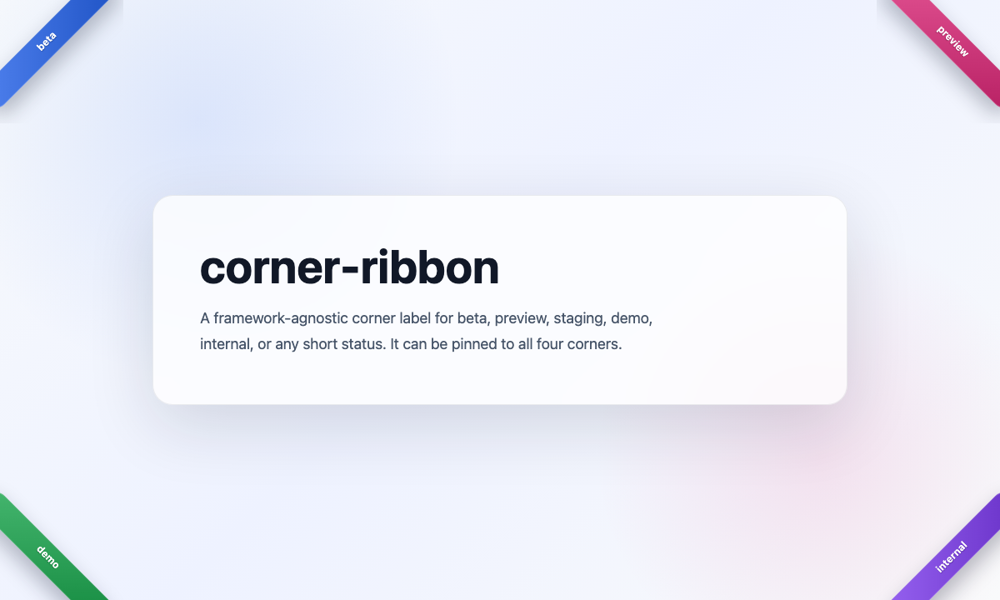

# tiny-corner-ribbon

フロントエンドの画面端に短いラベルを表示する、フレームワーク非依存の TypeScript ライブラリです。実装は DOM API と inline style のみで、React、Vue、Svelte、Next.js、Nuxt、Astro、Gatsby、CSS-in-JS、CSS フレームワークには依存しません。

`dev`、`staging`、`preview` のような環境名だけでなく、`beta`、`demo`、`new`、`internal` など任意の短いラベルに使えます。4つの角すべてに配置できます。



## インストール

```sh
npm install tiny-corner-ribbon
```

## 基本的な使い方

```js
import { mountCornerRibbon } from 'tiny-corner-ribbon'

mountCornerRibbon({
  text: 'beta',
  color: 'blue',
  position: 'left',
})
```

SSR を使うフレームワークでは、ブラウザ上で実行される lifecycle から呼び出してください。

## script タグで使う

JavaScript bundler を使わない静的サイトでは、auto entry を script タグで読み込めます。

```html
<script
  type="module"
  src="/path/to/tiny-corner-ribbon/dist/auto.js"
  data-text="beta"
  data-color="blue"
  data-position="left"
></script>
```

## 対応方針

同じ Vanilla API を、各 JavaScript frontend 環境のクライアント実行位置から呼び出します。フレームワーク専用 adapter は必要になるまで追加しません。Hugo のような静的サイトでは、script タグ経由で利用できます。

| 環境 | 使い方 |
| --- | --- |
| Vanilla | `mountCornerRibbon` を import、または auto script を使用 |
| React | client-side effect から呼び出す |
| Vue | `onMounted` から呼び出す |
| Svelte | `onMount` から呼び出す |
| Next.js | Client Component から呼び出す |
| Nuxt | client-only plugin または mounted hook から呼び出す |
| Astro | browser script から呼び出す |
| Gatsby | `gatsby-browser` から呼び出す |

## API

### mountCornerRibbon(options)

リボンを作成して対象要素に追加します。同じ `id` のリボンがすでに存在する場合は、追加前に削除します。

### createCornerRibbon(options)

DOM へ追加せず、リボン要素だけを作成します。

### unmountCornerRibbon(options)

同じ `id` で mount されたリボンを削除します。

## オプション

| Option | Default | Description |
| --- | --- | --- |
| `text` | `'label'` | 表示するラベル |
| `position` | `'left'` | `left`, `right`, `left-bottom`, `right-bottom` |
| `color` | `'blue'` | プリセット色、または任意の CSS color |
| `textColor` | auto | 文字色 |
| `target` | `document.body` | mount 先の selector または element |
| `shadow` | `true` | 可能な場合に Shadow DOM を使う |
| `dismissible` | `true` | クリックでリボンを削除する |
| `id` | `'corner-ribbon'` | remount / unmount に使う識別子 |
| `zIndex` | `9999` | リボンの z-index |
